# School_District_Analysis
Mod 4 analysis of (fake) school data

# School_District_Analysis
Mod 4 analysis of (fake) school data

## Overview of School District Analysis
The current school district requires an analysis of Math and Reading assessment scores for the fifteen (15) schools located in this area, including both district schools and charter schools. The distinction between district and charter schools will be ignored for the entirety of this analysis, with the exception of performance by school type. Several key metrics are presented here, providing actionable information for school district administrators. These key metrics include:  

* Top 5 Schools in % Overall Passing (Math & Reading)  
* Bottom 5 Schools in % Overall Passing  
* Average Math scores for each grade by school 
* Average Reading scores for each grade by school  
* School performance based on school budget per student
* School performance based on school size
* School performance based on school type

## Resources
Data Source: schools\_complete.csv, students_complete.csv  
Software: PythonData Dev Environment (Python 3.7.11), Jupyter Notebook 6.4.6
Dependencies: Pandas, Numpy

## Code Analysis
This analysis was done in a development environment using Jupyter Notebook (6.4.6), Python (3.7.11), and the Pandas and Numpy packages. The raw data was provided in two csv files, schools\_complete.csv, students_complete.csv. The students_complete.csv file required significant cleaning in the name column. Multiple affixes were included that were not applicable to students. Cleaning this column's data had no effect on the data. Additionally, the code in its final form includes multiple lines removing the Math and Reading Scores of Thomas High School ninth graders.

## Results of Statistical Analysis
A complete statistical analysis was completed for every school in the area of the school district. Upon completion of the analysis, potential academic dishonesty was discovered in the math and reading grades at Thomas High School in ninth grade. As such, an important component of this analysis will include the comparison of the original dataset against the newly completed analysis that has removed the data from all ninth grade students at Thomas HS. The following questions guided this analysis: 

* How is the district summary affected?
* How is the school summary affected?
* How does replacing the ninth graders’ math and reading scores affect Thomas High School’s performance relative to the other schools?
* How does replacing the ninth-grade scores affect the following:
	* Math and reading scores by grade
	* Scores by school spending
	* Scores by school size
	* Scores by school type

### District Summary
The district summary prior to revision included the following data points.  
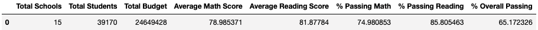

The revised district summary is as follows:  
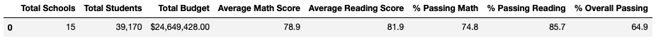

The difference between these summaries is negligible. Total Schools, Students, and Budget were unaffected. The students remain in the summary though their scores have been removed. The Average Math and Average Reading Scores, as well as the Percentage Passing Math and Percentage Passing Reading, we identical to the tenth of a percent. Overall passing, however, went down by 0.2% overall. This indicate that, though the effect of removing these scores was small reading and math, there was a tiny effect in the overall passing percentage.  

### School Summary
First we see the old Per School Summary Chart.  
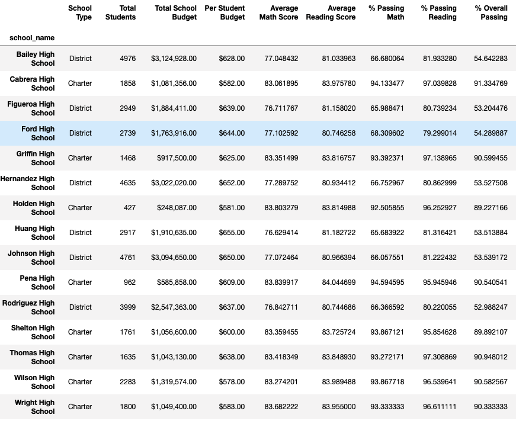

Here is the revised Per School Summary Chart.  
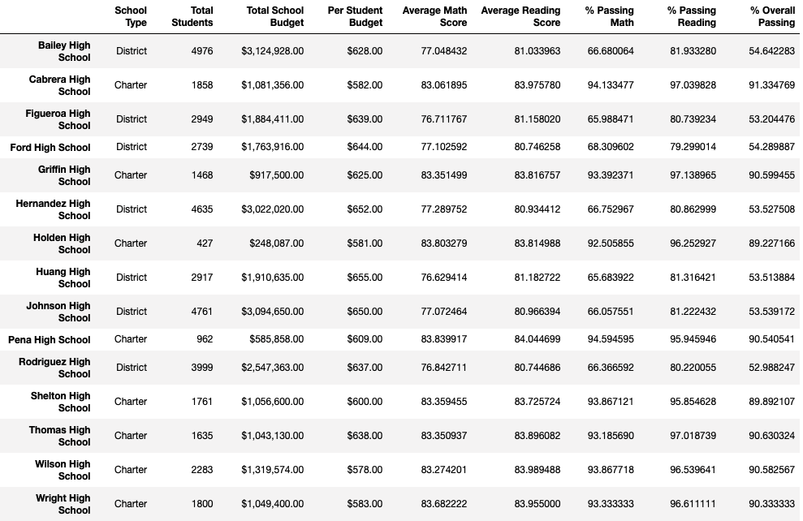

The relevant difference can be found in the row containing Thomas High SChool. The differences are, again, slight, but noticeable. In the Math Score and Percent Passing Math, the revised numbers are 0.06 points and 0.09 percent lower in the newly revised analysis. In the Reading Score and Percent Passing Reading, the revised numbers are 0.05 points higher, yet 0.3 percent lower in the newly revised analysis. Similarly, the Percent Overall Passing is approximately 0.3 percent lower. This suggests that the problem may lie primarily in the Reading Scores.  

### Ninth Grade Math and Reading Scores Replaced
The following shows the newly revised Math Scores by grade by school.  
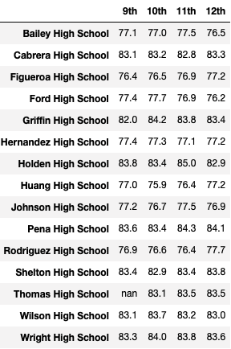

Prior to removing the 9th grade Math Scores of Thomas High School students, the score had been 83.6. This was one of the top scores among all the schools in the district.  
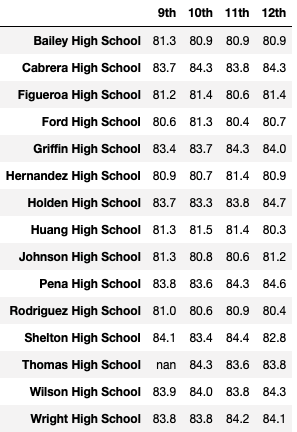

Similarly, the scores for Thomas High School ninth grade students in Reading had been 83.7. This was not the top score, but quite close to the top score of 84.1. 

In neither Math or Reading were Thomas High School scores the highest in the district, but they were Top 5 scores prior to their removal.

### Scores by School Spending
The following chart shows Scores by School Spending. Schools were dividing into four spending ranges ('<$584', '$585-629', '$630-644', '$645-675'). There was no discernible difference in removing Thomas HS 9th graders.  
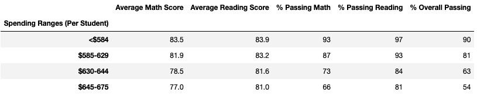

### Scores by School Size
The following chart shows Scores by School Size. Schools into three size categories: Small (fewer than 1000 students), Medium (1000-2000 students, and Large (2000-5000 students). There was no discernible difference in removing Thomas HS 9th graders.  
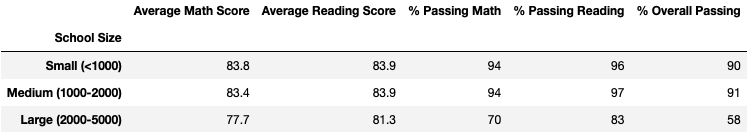

### Scores by School Type
The following chart shows Scores by School Type. Schools were divided into two categories by type: District Schools and Charter Schools. There was no discernible difference in removing Thomas HS 9th graders.  
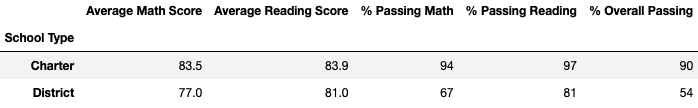

## Summary
Overall, the changes between the original analysis and the revised analysis that removed Math and Reading Scores from Thomas High School ninth graders was minimal. A few changes were notable, as listed above. The Math Scores and Percent Passing were slightly lower. The Reading Scores were lower, while the Percent Passing was slightly higher. The Overall Passing was also slightly lower. If there is any cause for concern, a closer look should be given to the Ninth grade Reading scores. Statistically, though, the scores do not seem to be signigicantly out of line with other similar schools in the district.  

The final two charts show the Top Five and Bottom Five Schools based on Percentage Overall Passing.
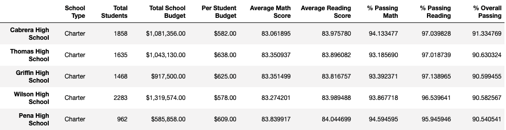  

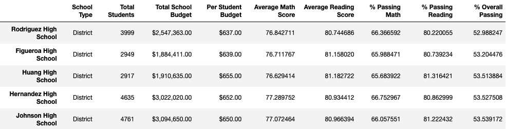
